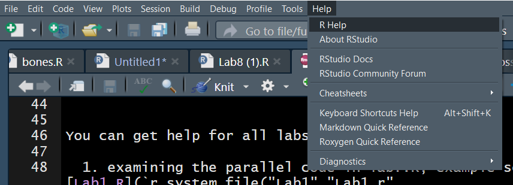

```{r, include = FALSE}
knitr::opts_chunk$set(
  collapse = TRUE,
  comment = "#>",
  message = FALSE,
  warning = FALSE,
  fig.align = "center"
)

dirdl <- system.file("Lab1",package = "Intro2R")
 

```

```{r setup}
library(Intro2R)

```


# Introduction

Since this is the first lab I will remind you of some basic formalities which will help you perform all the tasks of this and subsequent laboratories.

  1. Labs will generally be due on various days dependent on the semester. In the summer semester Labs follow in rapid succession and you will need to get things done quickly within one or two days of the previous lab dropbox close time. During the fall and spring semesters more time is allotted and usually you will have approximately one week to get the lab answered.

  2. All labs/assignments will need to be uploaded to CANVAS as knitted html documents.  No html? Then no marks!! Why html? The reason is that CANVAS labs will be graded through a browser and html will be seen easily -- also figures (png,jpg etc) and $LaTeX$ (Code that formats script into mathematical formulae example ` $\int_{-\infty}^{+\infty}f(x) dx$` gives $\int_{-\infty}^{+\infty}f(x) dx$ ) can be incorporated into the htmly file easily through RMD.

  3. Please note that for some of you,  getting up to speed with R will test your endurance and patience. Using all available helps will assist to prevent code exhaustion. 

You **MUST** use R markdown for all work - labs, assignments, minilabs, class exercises and projects where in each case the *RMD* document must ne knit to *html* and this file (the *html*) uploaded to CANVAS. The RMD file will not be graded and is a necessary intermediate to the final file. 

##  Getting help


You can get help for all labs by:-

  1. examining the parallel code in lab?.R, example see [Lab1.R](`r paste0(dirdl, "/Lab1.R")`)
  2. using help in RStudio 
  

  
  
  
  3. Use R help ?getwd etc on the command line
  4. Go to <https://bookdown.org/rdpeng/rprogdatascience/> 
  5. Google
  6. Youtube
  7. Library -- free online books
  8. r-project: <https://www.r-project.org/help.html>
  
## Formatting using R markdown

Please learn these things in the first week (days during Summer semester)

### YAML header (Top of RMD file)

Typically you will need to place the appropriate code and metadata into the *YAML* header at the top of the *RMD* document. This is not as difficult as you may think and the following will be mostly sufficient for the course:

```{r, eval=FALSE}
---
title: 'Lab 1'
author: "Possible Student"
date: '`r format(Sys.Date(),format="%A, %B %d, %Y")`'
output: 
  html_document:
    fig_caption: true
    highlights: pygments
    number_sections: no
    theme: spacelab
    toc: yes
    toc_float: yes
---
```


Please note that at any time you need more help please visit <https://bookdown.org/yihui/rmarkdown/> for more comprehensive help.

The *YAML* header is enclosed between a pair of 3 dashes `---` and all spaces and quotation marks are necessary.

### Code chunk document options

Immediately after the *YAML* header is an r chunk with options which will form the default options for all subsequent chunks in the document.

You can for the moment keep the default options as they are shown below.

```{r eval = FALSE}

knitr::opts_chunk$set(echo = TRUE)


```


### Body of the RMD document

You can use a lot of very useful tags to format your document. Please see the `cheatsheet` available here: <https://rmarkdown.rstudio.com/lesson-15.html>

Basically use `#` for a heading `##` for sub heading etc. Use `$$` for inline latex and `$$ $$` for main line latex code.


# Instructions

If you are not systematic and orderly and have become used to a disorganized file system then **NOW** is the time to change.

Make a directory for the course -- you may wish to call it MATH4753. Inside this make a number of sub-directories, Labs, Assignments, Data, Projects.

Inside the Labs folder create sub-directories called Lab1, Lab2, Lab3 etc 

Please download all the files for this lab into the appropriate folders

```{r,echo=FALSE}
dir(dirdl)
```


The data for the course is supplied by the book publisher.
Please unzip [Data for the course](`r paste0(dirdl,"/Data-for-thet-course.zip")`) into the `Data` folder. 

Now place [DDT.csv](`r paste0(dirdl,"/DDT.csv")`), [Lab1.R](`r paste0(dirdl,"/Lab1.R")`), [ddt-example.r](`r paste0(dirdl,"/ddt-example.r")`)  and [MATH4753Laboratory1.docx](`r paste0(dirdl,"/MATH4753Laboratory1.docx")`) in `Lab1`

# R skills

In order to effectively apply these rules and methods listed above we must master some basic R techniques and skills.

Just about everything in R is an object. To be useful these objects must have a name.

There are some data objects already made, named and installed in this package

```{r}
dim(ddt)
dim(flights)
```

Notice that there is a data frame object called "ddt" and it has 144 rows and 6 columns.

There is also another data frame object called "flights" which is much bigger and has 253,316 rows and 11 columns.

In order to manipulate larger data objects we will need packages that can more efficiently optimize subsetting. A good package for this is `data.table` which we will learn about later.

For now we will look at smaller data sets and learn basic ideas of subsetting using `base` R.

## Subsetting `[]`

Before we begin -- please note that Lab 1 has a script file that contains many helpful examples which will guide you in performing the tasks in this lab. see `r rmdfile("Lab1.R","Lab1.R", "Lab1")`

Lets start with a question -- How many fish of each species have more than 8 ppm DDT in their flesh?

We will answer this by building our knowledge of R


```{r}
ddt$DDT
ddt$DDT > 8
ddt[ddt$DDT > 8,]
```

This shows you that to subset we need a condition that produces `TRUE` or `FALSE` for each row of the data frame.

Notice that we use `[i,j]` to carry out the subsetting. We want all the rows where the condition is "TRUE". This will produce a data frame of smaller size (dimension `dim()`)

Now we collect the output and summarize it

```{r}
ddtg8<-ddt[ddt$DDT > 8,]
summary(ddtg8)
```

As you can see we have the answer to our question in the midst of a lot of output which answers more than our question.

Sometimes we need to be more specific

```{r}
#ddtl8$SPECIES
summary(ddtg8$SPECIES)
```

We are now in a place to answer the original question.
There are 56 Catfish, 0 Large mouth Bass and 9 small mouth Buffalo fish with more than 8 ppm DDT in their flesh.


# More advanced wrangling

A very useful package is `dplyr` which uses [`meta-programming`](https://adv-r.hadley.nz/metaprogramming.html) in its implementation. 

Lets ask and answer some questions using the [`dplyr` package](http://genomicsclass.github.io/book/pages/dplyr_tutorial.html).

## Filter 

Suppose we want to know about all the CATFISH caught on the `TRM` river. This is a sub-setting problem. Please note that we are using two functions:

  1. `%>%` an infix operator called a *pipe* - this is just a function but uses `meta-programming` in its construction. Here is an example of how you can define `infix` operators.
```{r}
`%mypipe%` = function(x,y) x*y - y^x
2 %mypipe% 3
```
  
  
  2. `filter` used to perform the sub-setting.

```{r}
data(ddt)
library(dplyr)
library(ggplot2)
df <- ddt %>% filter(RIVER == "TRM" & SPECIES == "CCATFISH")

g <- ggplot(df, aes(x = LENGTH, y = WEIGHT)) + geom_point() + ggtitle("Catfish caught on TRM")
g
```


## `by_group` stats by group

We may need to find the mean DDT in the flesh of each SPECIES of fish

```{r}
by_sp <- ddt %>% group_by(SPECIES) 
by_sp %>% summarise(DDT = mean(DDT))
```

## Select columns using `select`

Suppose we wish to select only the columns of `ddt` that contain $\tt{LENGTH, WEIGHT}$

```{r}
df <- ddt %>% select(LENGTH,WEIGHT) 
head(df)
```
## `mutate` columns

We may need to add new columns retaining all the former.

```{r}
Adf <- ddt %>% mutate(A = LENGTH*WEIGHT)
head(Adf)
```

## To arrange a data set

We may need to sort a data-frame based on a variable. For example to arrange the `ddt` data frame by increasing `DDT` we would do the following:

```{r}
df <- ddt %>% arrange( DDT)
tail(df)
```


Do something similar -- this time descending order of DDT

```{r}
df <- ddt %>% arrange(desc(DDT))
tail(df)
```

# Example taken from MS pg 43 2.28

## Radioative Lichen

```{r}
data(lichen)
lichen

```

We will now find the mean, median and mode of radioactivity levels

```{r}
lichen %>% group_by(LOCATION)%>% summarise(MeanLevel = mean(LOGCES), MedianLevel = median(LOGCES), ModeLevel = mymode(LOGCES) )
```


# Conclusion

We can of course go further -- now start on the lab and use all available resources.

Good luck and enjoy!!


