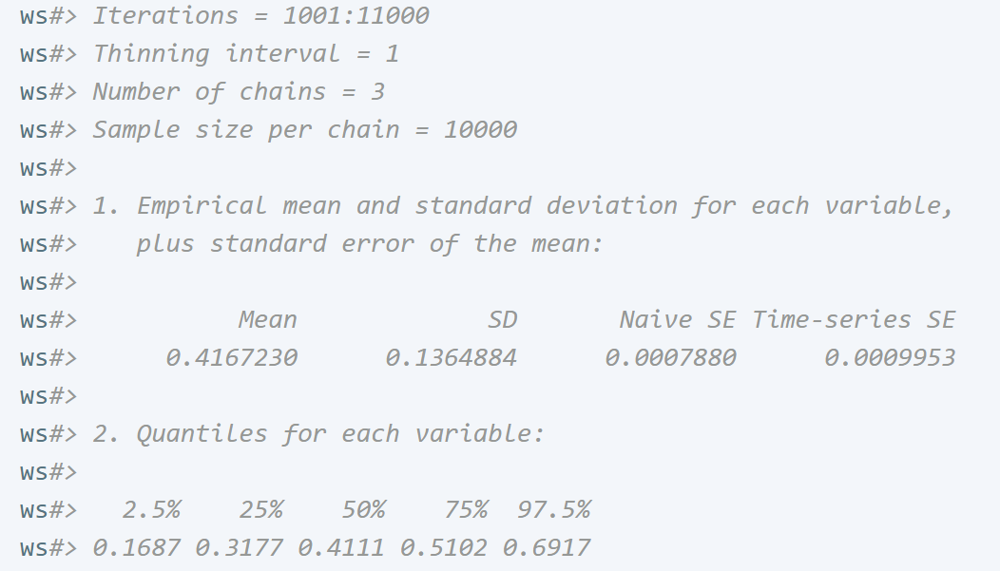

```{r, include = FALSE}
knitr::opts_chunk$set(
  collapse = TRUE,
  comment = "ws#>",
  fig.align = "center"
)

# directory to Lab
dirdl <- system.file("Lab13",package = "Intro2R")

# create rmd link

library(Intro2R)


```


# Introduction

This lab is made up of two parts:

>
  1. One sided testing
  2. Bayesian estimation
  
  
While one sided testing is within the syllabus for this course, Bayesian estimation is generally not within the pervue of the curriculum. However, since we have discussed the calculation of posteriors in the context of drug testing and a simple example of estimation is given in our text we have good grounds to look at this topic. 

Further, Bayesian theory is the crest of a new wave in statistical theory and practice. Many problems which could not be satisfactorily addressed under the classical paradigm can now be analyzed using Bayesian statistics.

Bayesian theory usually involves the implementation of various applied mathematical tools like `MCMC`. This *can* make the topic difficult to enter and make progress without investment of a lot of study and time. Over the years I have attempted to address these issues and have recently created a new course to help students proceed into this great statistical field. 

[If you wish to take Bayesian statistics further you could enrol in the online course `DSA 5403` at the university of Oklahoma.](https://www.ou.edu/coe/dsai)


# Sidedness

The fact that a classical test has a sidedness is fairly clear. We will take the same example used in our discussions in Lab 12.

## Two sided

Suppose we have the following hypotheses:


$$
H_0:p = 1/2\\
H_a:p \ne  1/2
$$


The alternate to the NULL hypothesis says that $p>1/2$ or $p<1/2$. If $H_0$ is false then $p>1/2$ or $p<1/2$. Because of the symmetry of the alternate we will reject the NULL if our statistic ( in this case `x`)
falls either in `0,1` -- this is evidence for $p<1/2$ or `9,10` -- evidence for $p>1/2$. By making this `RAR` we have a type 1 error with the following error.


$$
\alpha = P(R|p=1/2)\\
=P(x\in \{0,1\}|p=1/2) + P(x\in \{9,10\}|p=1/2)\\
=`r sum(dbinom(x=c(0,1), 10,1/2))` + `r sum(dbinom(x=c(9,10),10,1/2))`\\
=`r sum(dbinom(c(0,1,9,10),10,1/2))`
$$


## One sided

If we have prior information that would indicate that $H_a:p>1/2$ and use the rejection region $R=\{9,10\}$.

Look at the type 1 error rate

$$\alpha = P(x\in R=\{9,10\}|p=1/2)= \tt{sum(dbinom(9:10,10,1/2))}=`r sum(dbinom(x=c(9,10),10,1/2))`$$

To have the same or similar type 1 error rate we will need to increase the rejection interval

Suppose we make the one tailed rejection region $R = \{8,9,10\}$ then

$$\alpha = P(x\in R=\{8,9,10\}|p = 1/2) = `r sum(dbinom(x=c(8,9,10),10,1/2))`$$

The probability of a type 2 error can be calculated

$$\beta = P(x \in A|p=p_a) = \tt{sum(dbinom(A,size = 10,prob = p_{a}))}$$

where $A=\{0,1,2,3,4,5,6,7\}$ -- suppose $p_a=3/4$

$$\beta =\tt{sum(dbinom(0:7,10,3/4))}= `r sum(dbinom(0:7, 10, 3/4))`$$

# Bayesian Statistics

## Introduction

In Bayesian statistics we make Bayes' formula the center piece of our theory. Our goal is to obtain the posterior $p(\theta|x)$

$$p(\theta|x)  = \frac{p(\theta)f(x|\theta)}{p(x)}$$
which is proportional to the product of the prior $p(\theta)$ and the likelihood $f(x|\theta)$. The proportionality constant is:

$$\frac{1}{p(x)}$$
where $p(x)$ is called the marginal or evidence.

That is we could write:

$$p(\theta|x)\propto p(\theta)f(x|\theta)$$

In Bayesian theory we often relax the notation so that $p()$ does not necessarily stand for a probability function nor dows $f(x|\theta)$ necessarily stand for a density function. They could stand for either in both cases -- this is where context will inform you of the nature of these functions.


### Discrete $\theta$

Bayes' formula will be expressed


$$p(\theta|x) = \frac{p(\theta)f(x|\theta)}{\sum_{\Theta}p(\theta)f(x|\theta)}$$

### Continuous $\theta$

Bayes' formula can be written:

$$p(\theta|x) = \frac{p(\theta)f(x|\theta)}{\int_{\Theta}p(\theta)f(x|\theta)d\theta}$$

The denominator $\int_{\Theta}p(\theta)f(x|\theta)d\theta$ can often be very difficult to obtain. Fortunately in practice we do not need this constant to obtain a representative sample from the posterior.


## Software used in performing Bayesian statistics

There are many applications that will help us perform Bayesian statistics. Usually the software will require a modeling language used to represent the statistical model and an MCMC toolkit that will allow us to obtain a sample from the posterior.

The following are helpful:

>
  1. R package: rstan + requires c++ compiler -- usually Rtools will do -- see <https://mc-stan.org/users/interfaces/>
  2. R package: MCMCpack
  3. R package: rjags + Software for PC: JAGS 
  4. Software available through CRAN: <https://cran.r-project.org/web/views/Bayesian.html>
  


## MCMC

The way most of the software creates a sample from the posterior is through an algorithm called MCMC (Markov Chain Monte Carlo).

This is a big topic. There are many variants to this technique. The main idea is that a proposal function submits a `proposed` value of the parameter to be accepted or rejected upon some criterion. The accepted values form part of a `chain` of values that make up the posterior sample.

### Proposal

To give you some idea of the algorithm we will take the example given previously for the binomial experiment consisting of $n=10$ Bernoulli trials in which $x=4$ successes are recorded where the unknown probability of a success (H) is $\theta$

Notice that given $n,x$ only $\theta$ is unknown and is considered a random variable since we do not know is value.

We will take an independence proposal (sometimes called a `sampler`) i.e $f(\theta|\theta^{*})=f(\theta)$ where $\theta^*$ is the current value of the parameter.

$$q(\theta|\theta^*)=\tt{dunif(\theta,0,1)}$$

```{r}
pr <- runif(100)
plot(pr, type = "l", main="Proposal")
```


### Acceptance/Rejection

We need some way of filtering this output so that what we get is a sample from the desired density,

In our case we will assume a flat prior for $\theta$ so that according to Bayes' formula:

$$p(\theta|X=4) \propto 1\times  \theta^{4} (1-\theta)^{6} = h(\theta) $$

Suppose the proposal suggested a value of $\theta=0.2$ -- how can we decide to accept or reject it. The way this will be done is to accept it if it has a larger $h$ value.

That is suppose we currently have $\theta^*$ as the latest in our list of accepted values, then we will accept the proposed value $\theta$ with a certain probability (the acceptance probability $\alpha_{i,j}$,  $i \rightarrow j$ next state)

$$\alpha = \frac{h(\theta)}{ h(\theta^*)}, \tt{if\; h(\theta)<h(\theta^*)}$$
$$\alpha = 1 \; \tt{else}$$

Notice that we will always (with certainty 1) accept the proposed value if $h(\theta)$ is bigger than $h(\theta^*)$ and with probability $\alpha<1$ otherwise.

Lets do it in R

```{r}
iter <- 10000
init <- 0.01 #inital value to start the simulation
accept <- vector("integer", length = iter)
accept[1]<-1
post<-vector("integer",length=iter)
post[1] <- init # initial value

h<-function(x) x^4*(1-x)^6 # h function proportional to posterior

for(i in 2:iter){
  pr <- runif(1,0,1) # prob between 0,1
  
  ifelse(h(pr)<h(post[i-1]), alpha<-h(pr)/h(post[i-1]), alpha<-1)
     
     
  ifelse(runif(1,0,1)< alpha,
         {post[i] <- pr
         accept[i]<-1}, #if true
         {post[i] <- post[i-1]
         accept[i]<-0}# if false
         )
  
}
plot(post, type="l")

mean(accept) # fraction of iteration accepted by the MCMC sampler

mc <- coda::as.mcmc(post) # USe Coda to make some plots and summary stats

plot(mc)
summary(mc)

```

## Conclusion 

This is the result of our home made MCMC sampler. We have a point estimate (the posterior mean) of 0.415.
The sampler was 42.3% efficient (accepted 42.3% of proposed values).
The trace plot (showing the post vs index) has a mean value and randomness either side. This looks like a good posterior sample because there appears no trend and therefore likely the sampler reached steady state (known as the  `stationary state`).

The coda plots show a single mode density around the point estimate. Summary stats are useful if we needed interval estimates. 

## Jags -- same problem

We can use the BUGS language to make a statistical model that does essentially the same thing. This has the advantage that the MCMC part is well implemented and more models can be made quickly. 


```{r,eval=FALSE}
library(rjags)
binmodel <- " model {
    x ~ dbinom(p,n) # Likelihood
    p ~ dbeta(1,1) # Unif(0,1)
    }
    "
cat(binmodel, file = "binmodel.txt")
d<-list(x=4, n=10)
m<-jags.model("binmodel.txt", d, n.adapt=999,inits = list(p=0.5), n.chains=3, quiet=TRUE) 
    update(m)
    q<-coda.samples(m, c("p"), 10000)
    summary(q)
    
library(ggmcmc)
   s<- ggmcmc::ggs(q)
   ggmcmc(s,file = "plots.html")
```

<center>
{ width=80% }
</center>
# Finally 

With this brief inroduction you may now start on the lab

`r rmdfiles("Lab13","Intro2R")`
