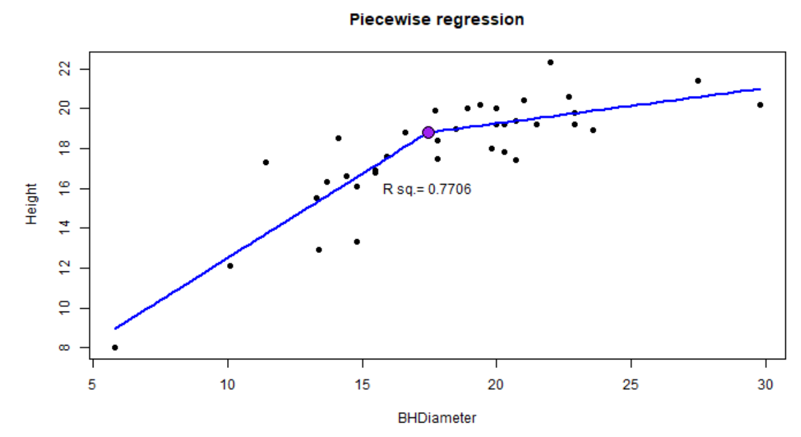

```{r, include = FALSE}
knitr::opts_chunk$set(
  collapse = TRUE,
  comment = "ws#>",
  fig.align = "center"
)

# directory to Lab
dirdl <- system.file("Lab4",package = "Intro2R")

# create rmd link

library(Intro2R)


```


# Introduction

Lab 4 is primarily about fixing the problem which is apparent in Lab 3 namely the non linear trend seen in the data.

This means that a different model must be used. But which model? Since we have one model by default -- the strait line, we will compare it with another model on the basis of some criterion. 

## Criteria

> 
  1. Information measures 
      + AIC (Choose model with smallest AIC)
      + DIC
      + BIC
      + ...
  2. Penalized $R^2$ also known as adjusted R squared, $R_a^2$
  3. [Mallows's $C_p$](https://en.wikipedia.org/wiki/Mallows%27s_Cp) (Choose smaller $C_p$ -- equivalent to AIC for guassian regression)
  4. In cases  where one MLR model is nested in the other we can use an ANOVA test.
  
  
  There are others. 

# R skills

## Plots

We have already been introduced to Linear and Non-Linear models.
Briefly linear models can be expressed as a linear combination of the parameters and non-linear models cannot be.

In lab 3 you were introduced to the `shiny` server which enables you to create a dynamic input/output server. 

Lab 4 does two major things:

>
  1. Fits a curve to the data
  2. Derives and applies the theory for piecewise regression
  
  
The following will remind you of some things you have learnt in the past and extend others.


### Smoothers

#### Background

In the R package `ggplot2` there is a function called `geom_smooth()` -- this enables you to create estimating trends for your data.

The word `smoother` is less technical than the precise idea of an estimating trend line. The `smoother` is best in the context of `ggplot` because we will use non parametric models which seek only to gather a smoothed curve/line based on the data itself.

One example of a smoother is known as LOESS  (locally estimated scatterplot smoothing) and LOWESS (locally weighted scatterplot smoothing). This is non-parametric meaning that we do not invoke a parametric model and find estimates of the parameters rather we apply weight least squares regression over a window of the data where more weight is given to the middle value and less on the boundaries. The window is moved through the domain of the data and a curve generated from the predicted response. This means that the curve is "data" generated and gives you a better idea of what the data is saying concerning the `trend`.

### Example

Lets go ahead and use `LOESS` to create a smoother 

```{r}
library(ggplot2)
gs <- ggplot(ddt, aes(x=LENGTH,y=WEIGHT)) + geom_point(aes(color = SPECIES)) + geom_smooth(method = "loess")
gs
```


You can make good use of smoothers to represent complex models by including an aesthetic that will divide the data and apply the model to subsets. In this case we have a Non linear model applied to each of the species.

```{r}

g <- ggplot(ddt, aes(x = LENGTH, y = WEIGHT)) +
  geom_point(aes(color = SPECIES)) 
g <- g + geom_smooth(method = "nls", formula = 'y ~ b0*exp(b1*x)', method.args = list(start = list(b0 = 100, b1 = 0.05)),se = FALSE, aes(color = SPECIES))
g <- g + labs(title = "nls fitted to subgroups of SPECIES")
g
```

  
# Piecewise smoother

You will need to understand the development of this:


# Introduction

Suppose we have two line segments which make a reasonable fit to data, joining at a single point `(x_k,y_k)` which we may call the `change point`. We wish to use data to estimate the lines and some measure of `fit` to determine the `change point`.

# Theory

Suppose that for line 1 and line 2 we have the following formulae


$$l1: y=\beta_0 +\beta_1 x$$
$$l2: y = \beta_0 + \delta +(\beta_1 + \zeta)x$$


{ width=70% }


Then at the change point we have the two lines intersecting

$$\beta_0 +\beta_1x_k = \beta_0+\delta + (\beta_1 +\zeta)x_k$$

Hence we have 

$$\delta=-\zeta x_k$$

Therefore we can write `l2` as

$$y = \beta_0 -\zeta x_k + (\beta_1 +\zeta)x $$
That is 

$$ y = \beta_0 + \beta_1 x + \zeta (x-x_k)$$

`l2` is `l1` with an adjustment term.

We will introduce an indicator function that will be 1 when $x>x_k$ and $0$ else.

So

$$y = \beta_0 + \beta_1 x +\zeta (x-x_k)I(x>x_k)$$


# Create plot using `ggplot`

```{r}
library(ggplot2)
xk = 18
dff <- spruce
df <- within(dff, X<-(BHDiameter-xk)*(BHDiameter>xk))
head(df)
ylm <- lm(Height ~ BHDiameter + X, data = df)
summary(ylm)
gg <- ggplot(df, aes(x = BHDiameter, y= Height)) + geom_point() + 
  geom_smooth(method = "lm", formula = 'y ~ x + I((x-xk)*(x>xk))', se = FALSE, data = df)
gg
```


# Generalization

Since the next line segment is the addition of an interaction term we can easily generalize this procedure

Say we have two `change points` and thus three line segments.

Then:

$$ y=\beta_0 + \beta_1 x + \beta_2 (x-x_k)I(x> x_k) + \beta_3 (x-x_{k2})I(x>x_{k2}) $$

# Application

Add two change points to the `Spruce.csv` data set and make a plot of the line segments.
Make $x_k=10$ and $x_{k2}=18$

```{r,fig.align='center'}
spruce.df = spruce
head(spruce.df)
myf2 = function(x,xk,xk2,coef){
  coef[1]+coef[2]*(x) + coef[3]*(x-xk)*(x-xk>0)+ coef[4]*(x-xk2)*(x-xk2>0)
}

coeff = function(xk,xk2){ # data=spruce.df
  df=within(spruce.df, 
            {
            X<-(BHDiameter-xk)*(BHDiameter>xk) 
            X2<-(BHDiameter-xk2)*(BHDiameter>xk2)
            }
            ) 
  lmp=lm(Height ~ BHDiameter + X + X2, data=df)
  coef(lmp)
}


with(spruce.df,plot(BHDiameter, Height,
                    pch = 21, 
                    cex=1.5,
                    bg="green",
                    main="Height Vs BHDiameter using piecewise regression"
                    ))

cf = coeff(10,18)
curve(myf2(x,10,18,cf), add=TRUE, lwd=2,col="Blue")


```


# Questions to consider (Not a part of the Lab -- extra for experts!!)

1. Make a shiny app that will plot points and fit a 3 segment model using changepoints set through widgets

2. Adjust the app so that AIC is displayed (Keep `k=2` as default) `AIC()` is displayed on the upper plot.

3. Find optimal knots -- what criteria would you use?


## Some code

```{r}
# combinations of xk1<=xk2
n=4
x=seq(5,20, length=n)
for(xk1 in x[x<=(max(x)-3)]){
  for(xk2 in x[x>=xk1]){
    print(paste0("xk1=", xk1,", ", "xk2=",xk2))
  }
  }

```


# Summary of Lab 4 main ideas

It is a good idea to start with a straight line and then see how the model is working by investigating the residuals. Typically a plot of the residuals versus the fitted values is a good idea `plot(ylm, which =1)`.

If additional signal is in the residual plot then you will need to adjust the basic simple straight line model. Sometimes a higher term polynomial will work well or perhaps a non linear model like an exponential `y ~ b0*exp(b1*x)` -- you can fit this with `nls()` -- see above examples. Unless you are proficient with non linear models  it will be best for you to stick with linear models. 

To check which model is better you will need a criterion. Many statisticians use `AIC`since this is generally applicable -- choose the model with smallest `AIC`. If you use `MLR` (multiple linear regression) as in the case of a quadratic then for our course we can use $R_a^2$ -- choose the model with the biggest adjusted R squared. 

You may need to try a few linear models until the assumptions are confirmed. Once the best model is determined ("best" determined by satisfying the criteria of a Linear Model and the biggest $R_a^2$) then go ahead and use that model to solve whatever problems you have been confronted with.


  
# Lab 4 

Please download the following files into appropriate directories

`r rmdfiles("Lab4")`

