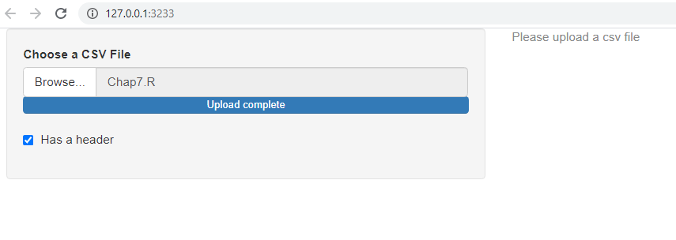
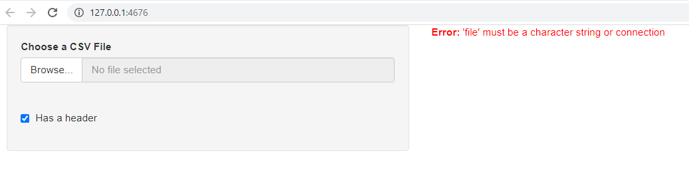
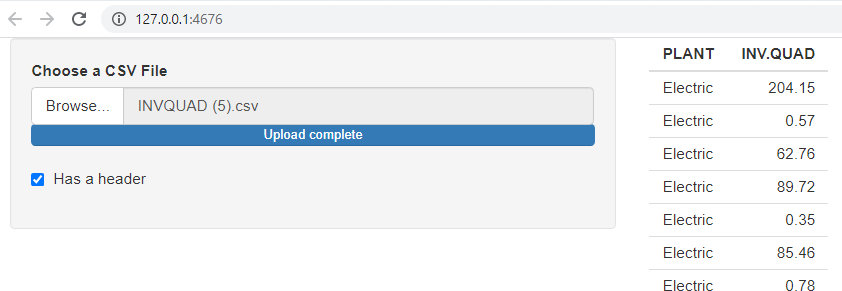

```{r, include = FALSE}
knitr::opts_chunk$set(
  collapse = TRUE,
  comment = "ws#>",
  fig.align = "center"
)

# directory to Lab
dirdl <- system.file("shiny",package = "Intro2R")

# create rmd link

library(Intro2R)
```

# Introduction

The shiny server allows the data scientist to take an otherwise static application and make it dynamic. This is done through the use of a concept called "reactivity".

In this document we will begin from the basic structure of the server application and then introduce the detail of the parts which make the programming easy.

This is "magic" with some plans and rules.

A very good resource can be found here: <https://mastering-shiny.org/index.html>

# Getting started

{width="200"}(<https://mastering-shiny.org/index.html>)

The above book has a lot of detail which we can use and implement. In order to jump start the process of learning we will ask and answer a question.

# Question

How can we make a shiny table for any data set? We will attempt to answer this question and then after viewing our solution ask more questions answer these and repeat. In so doing we will come to grasp the essentials of "reactive programming".

## Getting started

The basic idea is to carry out the following:

-   Input data

-   Input header TRUE/FALSE

-   Tabulate data as output

## Data Input

The way shiny does this is by using various widgets. The first widget we will use is the shiny function `fileInput()`

```{r, eval=FALSE}

fileInput(
  inputId,
  label,
  multiple = FALSE,
  accept = NULL,
  width = NULL,
  buttonLabel = "Browse...",
  placeholder = "No file selected"
)


```

The function has 7 options, the first is:

-   `inputId` this is needed for every widget and enables us to find the particular widget and the user values set. Best to use an id whose name points us to the particular function of the widget.

-   `label` is the label that will be placed with the widget which the user will read and understand what he/she needs to input.

-   `multiple` is by default `FALSE` and is used to indicate whether multiple files should be read in at once.

-   `accept` is a character vector of file extensions to help the browser show only those types to choose from.

The rest we will leave for now but you can read more from the documentation.

Notice that the widget does not actually read in the data, the widget will provide the name of the file - is this all the information required to read in the data? No! We need to know whether the file has a header or not.

To get this information we need another widget, `checkboxInput().`

```{r,eval=FALSE}
checkboxGroupInput(
  inputId,
  label,
  choices = NULL,
  selected = NULL,
  inline = FALSE,
  width = NULL,
  choiceNames = NULL,
  choiceValues = NULL
)


```

As with the previous widget there is the input id:

-   `inputId` an id that uniquely identifies this widget

-   `label` a label that will be intelligible to the user.

-   `choices` The choices that the user can select

-   `selected` What is the default choice

The rest are easy and we will leave them for now. In our case we need to ask the user to select whether the data have a header or not. We will assign one choice "TRUE" and then leave selected to "NULL".

## Make a ui

A possible user input for a shiny app would go like the following:

```{r,eval=FALSE}
 ui <- fluidPage(
      sidebarLayout(
        sidebarPanel(
          fileInput("fileName", "Choose a CSV File", accept = ".csv"),
          checkboxInput("header", "Has a header!", TRUE)
        ),
        mainPanel(
          tableOutput("fileContents")
        )
      )
    )
```

Notice that a lot of the above code is simply setting up formatting for the html page that will hold the various parts:

-   A place on the left for the side panel which will hold the two widgets and

-   A place in the middle called "mainPanel" for the output table using the function `tableOutput().`

The ui functions to place input and output on the html page and also to supply the server with information concerning the file (name, header = TRUE/FALSE)

The picture below shows you some of what the above UI does.


## The server

Now that we have made the ui functional part of the app we shall go to the second functional part called `server.`

In all shiny apps there are two lists that are automatically made by the shiny package:

-   input

-   output

To get the value selected by the user when using the widgets the technique is to use the `input$id,` list and id name.

The server function uses two inputs which are the two lists named above. To populate the output area defined in the ui we simply fill the output list appropriately. We may have defined many different places for output in which case we would populate the `output` list using the appropriate ids. In our case we have one area of output and it is a table.

We therefore use `output$fileContents <- renderTable()` Notice that the function is "renderTable". All shiny server functions that populate the output will need to be "render" functions.

The server function is given below:

```{r,eval = FALSE}
server <- function(input, output) {
      output$fileContents <- renderTable({
        newfile <- input$fileName
        ext <- tools::file_ext(newfile$datapath)

        req(newfile)
        validate(need(ext == "csv", "Please upload a csv file"))

        read.csv(newfile$datapath, header = input$header)
      })
    }
```

Note that the `read.csv()` is called last after `req()` and `validate()` functions are invoked.

Why?

-   We need to make sure that a file exists - when the app is first started there will not be a file selected by the user. The `renderTable` will then be incapable of reading a file because there will be no valid `input$fileName` to use in the `read.csv()` function. What to do? Well we should simply not execute the render function until there is a file selected. This is what `req()` does.

-   Secondly we need to validate that a csv file was chosen -- if the file extension is not a csv then give message "Please upload a csv file" and stop the function.

-   We could make do with only the `validate()` function, however the `req()` is good practice.

The following shows how the app will run after a wrong file is selected:



The above picture shows the message but read.csv is not called on the wrong file due to `validate().`

If both the req() and validate() are removed this is what you would see when the app is run:



The header is determined by the `input$header` component of the input list.

# Putting it all together

Notice that the app placed in the r chunk below cannot be run when the RMD is knitted so we use the condition on `interactive()` - when knit, the R chunk will give a `FALSE` `interactive` result. Hence the app will not be run. You can run it by selecting the app in the RMD document.

```{r, eval = FALSE}
## Only run examples in interactive R sessions
interactive()
if (interactive()) {

ui <- fluidPage(
  sidebarLayout(
    sidebarPanel(
      fileInput("fileName", "Choose a CSV File", accept = ".csv"),
      checkboxInput("header", "Has a header", TRUE)
    ),
    mainPanel(
      tableOutput("fileContents")
    )
  )
)

server <- function(input, output) {
  output$fileContents <- renderTable({
    newfile <- input$fileName
    ext <- tools::file_ext(newfile$datapath)

    req(newfile)
    validate(need(ext == "csv", "Please upload a csv file"))
    

    read.csv(newfile$datapath, header = input$header)
  })
}

shinyApp(ui, server)
}

```

# Run the app

The following is the output when data file is selected:


